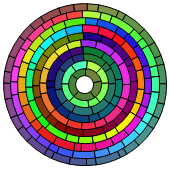

# Some sample images generated with Turtle Graphics VBA in png format

The code for all these samples is available in the [samples.bas](https://github.com/fizban99/TurtleGraphicsVBA/blob/main/src/TurtleGraphicsCanvas/Samples.bas) file.

